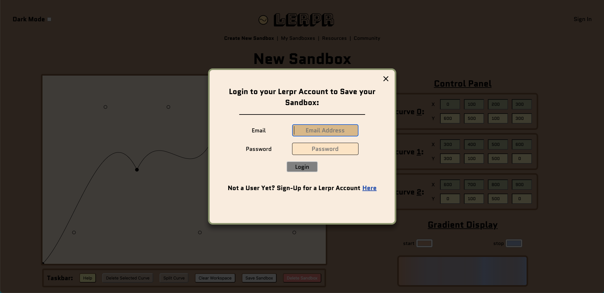
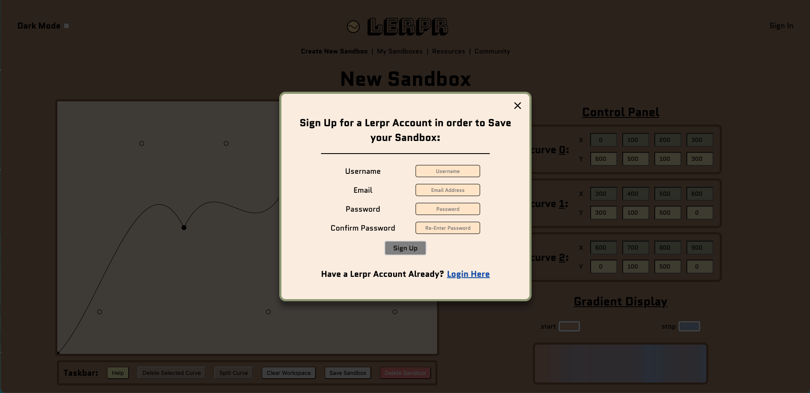
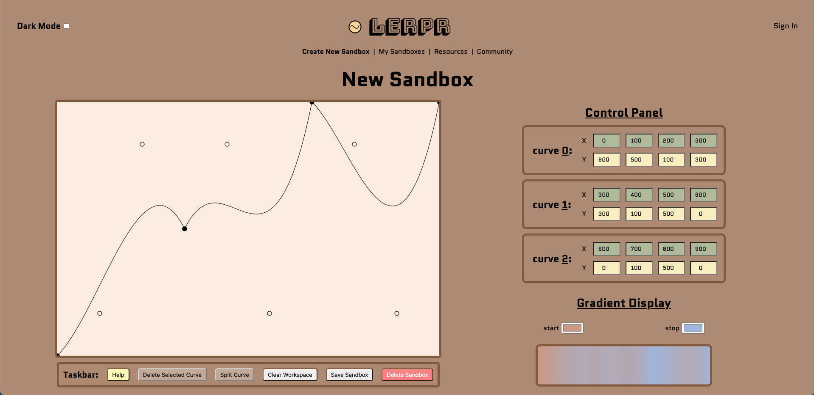
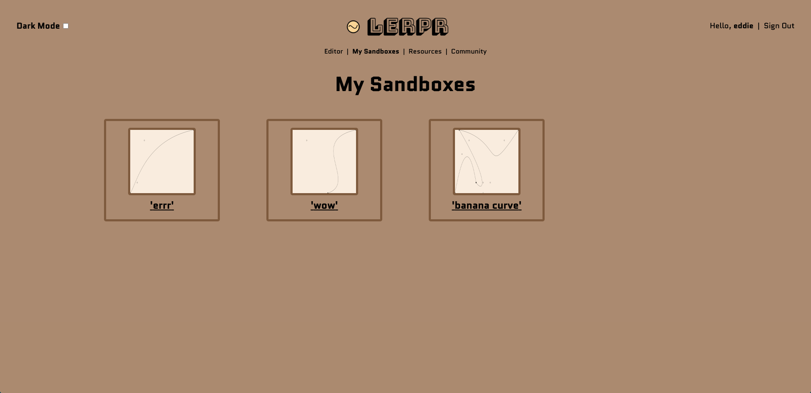
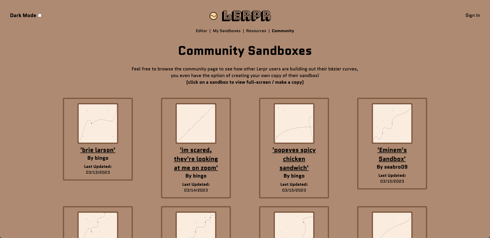
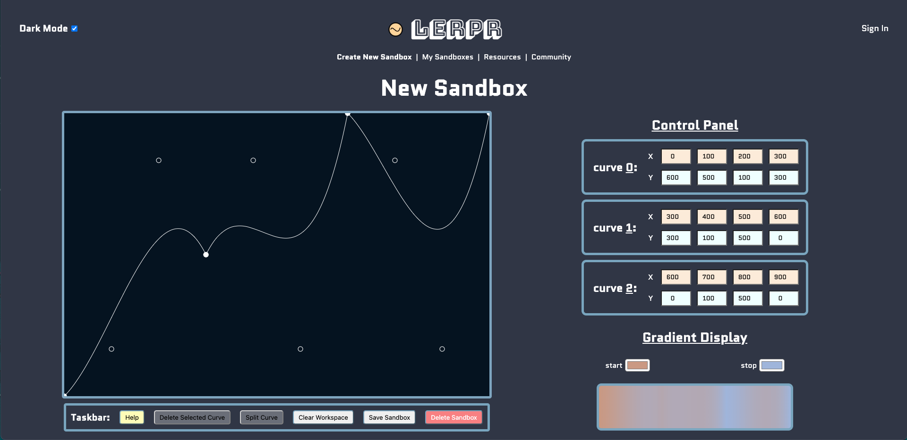
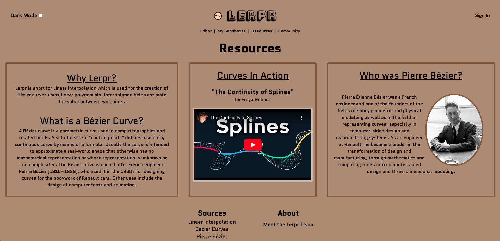
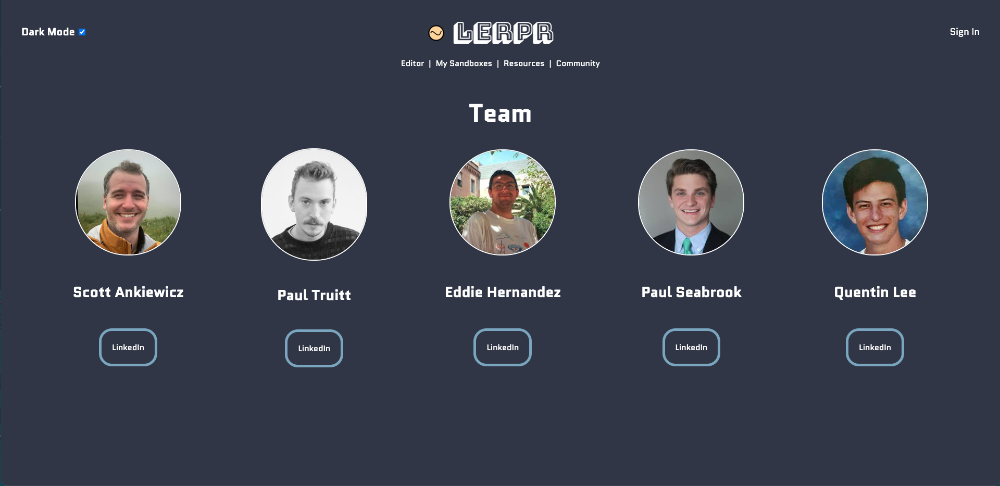

#

## <a href="https://lerpr.pro/">Click to Demo</a>

| The Team        | Development Role |                                                                               LinkedIn                                                                                |                                                                      Github                                                                      |
| :-------------- | :--------------: | :-------------------------------------------------------------------------------------------------------------------------------------------------------------------: | :----------------------------------------------------------------------------------------------------------------------------------------------: |
| Eddie Hernandez |    Front-End     |                              |  |
| Paul Seabrook   |    Front-End     |  |        |
| Paul Truitt     |    Full-Stack    |            |             |
| Scott Ankiewicz |     Back-End     |        |               |
| Quentin Lee     |     Back-End     |                |               |

## :pencil: Description

<b>Lerpr</b> is an innovative sandbox application that showcases the power of bézier curves in manipulating lines based on an x/y grid. With its easy-to-use CRUD functionality, users can create, read, update and delete their own sandboxes, allowing for endless experimentation and creativity. Users also have the opportunity to view and duplicate a copy of sandboxes created by other Lerpr users via the community page.

 

  
  ## :camera_flash: Screenshots
  
  

Sign In
</img>

  

Sign Up
</img>

  

Editor/Dashboard
</img>

  

My Sandboxes
</img>

  

Community Sandboxes
</img>

  

Dark Mode (Color Theme)
</img>

  

Resources
</img>

  

Team
</img>

## :computer: Technologies Used

## :zap: How To Use

🏜️ Ready to Create? 🏜️

1. `Create An Account` by using the Create An Account button in the bottom of the page.
2. Fill out the form and once completed click the `Sign Up` button to login.
3. Upon login, you will find yourself at the Dashboard/Editor page, where you can create a new bézier curve.
4. Use the Control Panel feature on the right to pinpoint where on the x/y grid you'd like each point to be.
5. The `Taskbar` underneath the sandbox area allows for optimal design control: `Save` your sandbox in its current form, `Delete` a selected curve, `Clear Workspace` deletes all curves, `Split` a selected curve to add a new curve directly in between the selected curve and the following curve (if any), and `Help` covers similar basics discussed here.
6. `Click` on either 'My Sandboxes', 'Resources', or 'Community' to navigate to each page respectively.
7. The 'Resources' button will take you to a page where you can access educational resources on bézier curves.
8. Inside the 'Community' page, you can check out all of the curves the community has built on their own and even duplicate a copy of theirs!
9. The 'My Sandboxes' page is a one-stop shop of all of your personal bézier curve creations.
10. Don't forget to toggle the 🌑 'Dark Mode' 🌕 option on the top left to navigate the application in a whole new light.

## :world_map: Design

    
Trello Board 

  <a href="https://trello.com/b/MdiMxixR/lerpr"
    > Development Trello</a>

  
 Deployed Link (Heroku) 

  <a href="https://lerpr.pro/"
    > Lerpr Website</a>

## :rotating_light: Planned Features

[:x:] Allow for the use of different types of splines 
[:x:] Add the ability to toggle a grid background 
[:x:] Enable image uploads for tracable backgrounds 
[:x:] Add changeable line colors 
[:x:] Allow users to toggle a line rider on their bézier curves 
[:x:] Add the ability to buy Lerp Coins 
[:x:] Create a Shop feature for users to spend Lerp Coins on different color themes and line colors 
[:x:] Allow users to shade regions inside of lines 
